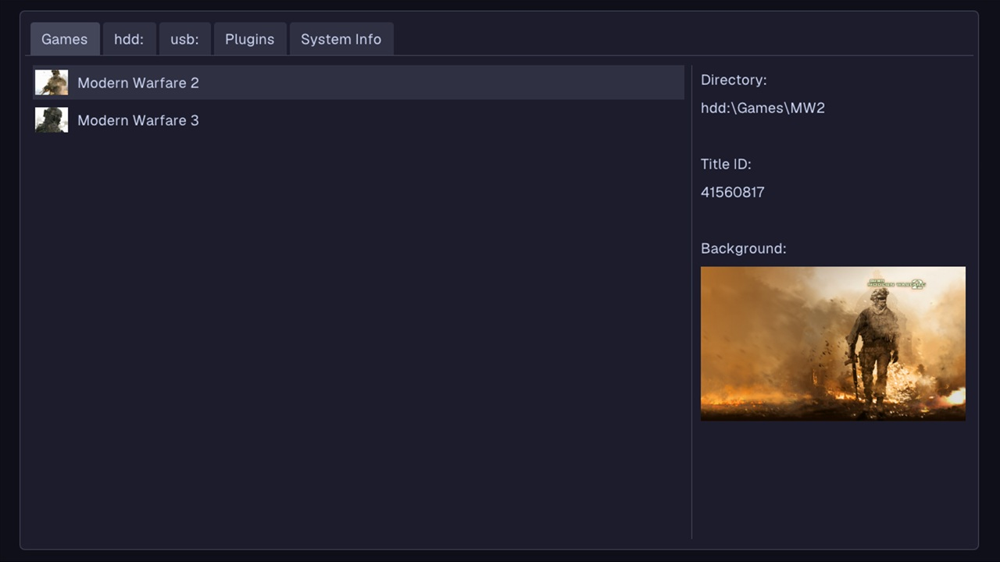
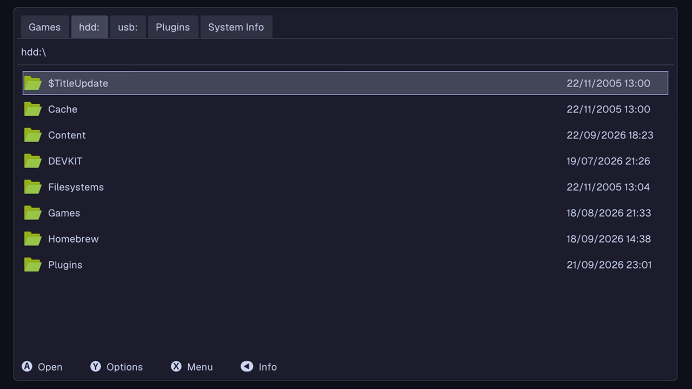

# OpenDash

OpenDash is a custom dashboard for the Xbox 360 that aims to be simple and intuitive. See it as an alternative to XeXMenu, not as something with lots of features like Aurora.

## Features

| Games tab                               | HDD tab                             |
| --------------------------------------- | ----------------------------------- |
|  |  |

- A games discovery similar to XeXMenu. It looks for games installed in `hdd:\Games`.
- A file explorer for each storage device. The hard drive, the first USB and the DVD are currently supported, with the DVD being a read-only device.
- A plugin manager. It looks for plugins located in `hdd:\Plugins`.
- A tab with information about the system like the IP address and the temperatures of various hardware components.

## Download

The latest build is available in the [releases](https://github.com/ClementDreptin/OpenDash/releases). Each release is available in 2 formats:

- OpenDash.zip
  A regular directory with all the files to run the app. Move the content of the zip somewhere on the console and run OpenDash.xex.
- OpenDash-demo.zip
  A game demo (same format as the "live" version of XeXMenu) with the full file tree from the root of a storage device. Move the `Content` directory to a storage device (hard drive or USB). You probably already have a `Content` directory on your device, it will not overridden, its content will be merged with the `Content` directory from the zip.
  You should now see OpenDash in the Games section of the official dashboard.

## Building

Clone the repository and the submodules:

```
git clone --recursive https://github.com/ClementDreptin/OpenDash.git
```

### Requirements

- Having the Xbox 360 Software Development Kit (XDK) installed.
- Xbox 360 Neighborhood set up with your RGH/Jtag/Devkit registered as the default console (only necessary if you wan't to deploy to your console automatically).

### Visual Studio 2010

Open `OpenDash.sln` in Visual Studio.

### Any other environment

Xbox 360 projects can't be built with the 64-bit version of MSBuild, you need to run the 32-bit version. You can make yourself an alias for convenience:

```PS1
# Create an alias to the 32-bit version of MSBuild named msbuild.
# The default installation path of VS2026 is C:\Program Files\Microsoft Visual Studio\18\Community.
Set-Alias msbuild "<path_vs2026>\MSBuild\Current\Bin\MSBuild.exe"
```

Now run `msbuild` and OpenDash is deployed to the `devkit:\OpenDash` directory (same as `hdd:\DEVKIT\OpenDash`).
